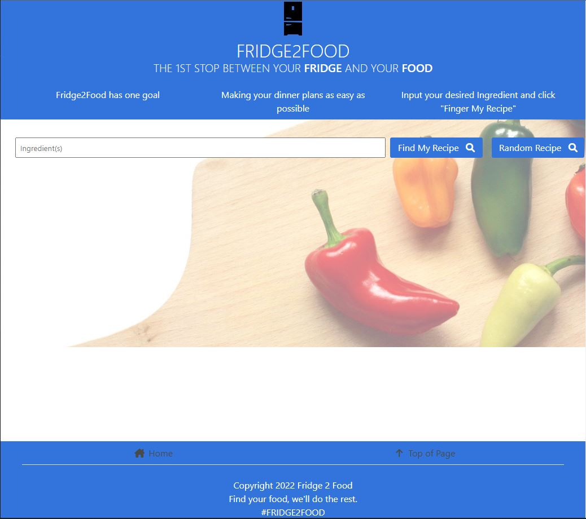

# 🍔 Fridge2Food 🍔
A mobile forward, web based application which allows users to find recipes based on the available ingredients in the fridge. 

Fridge2Food will strive to make cooking easier and cost-effective by eliminating the need to throw away spoiled or rotten food due to random and/or left over ingredients in the fridge. 

## Technologies: 
* HTML
* CSS
* JavaScript
* Jquery
* Bulma 
* Spoonacular API (from RapidAPI)

## How To:
* Navigate to the `Ingredient(s)` Search Bar, and type in the desired Ingredient to search for populated Recipes. Press `Enter` or Click `Find My Recipe 🔎` button
* A List of 10 Recipes pertaining to the desired Ingredient entered will appear below the Input Form
* Recipe Image | Recipe Title | Recipe Link (opens in new tab) will be contained within Bulma Cards and displayed in a vertical column.

## Screenshot:
(link)

## Future Implementations:
* Search of Multiple Ingredients with results appearing
* Modal pop up of Recipe Ingredients with API Link to local Grocery Store Delivery via Instacart (or other accessible API)

## Author(s):
* Joshua Ballard
* Mihir Patel
* Jeffrey Young

## Contact Information:
* Joshua Ballard: https://github.com/Joshuajword
* Mihir Patel: https://github.com/Mpz45
* Jeffrey Young: https://github.com/jeffymiyoung

---
© 2022 Fridge2Food
